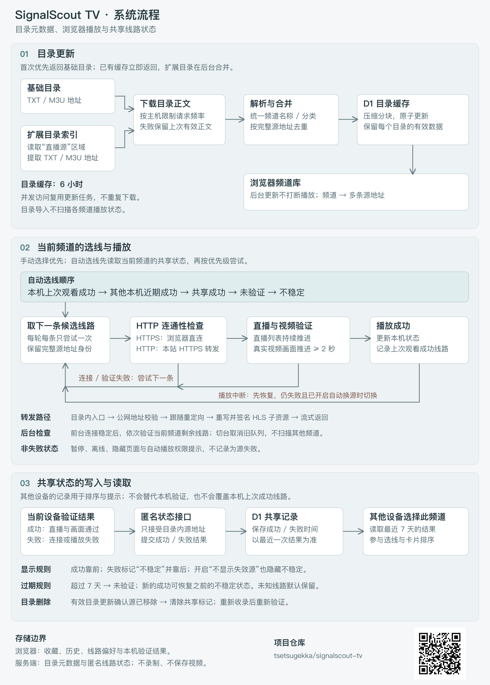

<div align="center">
  
  <h1>SignalScout TV</h1>
  <p>聚合直播目录，保留每条线路，让浏览器自己找到能播放的连接。</p>
  <p><a href="https://signalscout-tv.rafolia.chatgpt.site/">在线体验</a> · <a href="#本地运行">本地运行</a> · <a href="#工作原理">工作原理</a> · <a href="SPEC.md">详细规格</a></p>
</div>

SignalScout TV 是一个面向浏览器的电视直播播放器。它在运行时读取 GitHub 上的 TXT / M3U 目录，将同一频道的不同线路合并并去重；选择频道后，先检查连接，再验证直播画面。你可以手动选择线路，也可以让播放器自动寻找可用连接。

无需应用账号。收藏、观看历史和本机线路偏好保存在当前浏览器；实际验证成功／失败的线路结果会匿名共享，供其他访客排序参考。项目不内置频道快照、不预置“可播”结果，也不录制、保存或转码视频。

## 功能一览

| 功能 | 实际行为 |
| --- | --- |
| 多源目录 | 先显示已有目录；首次无缓存时先加载基础目录，再后台补充扩展目录 |
| TXT / M3U | 下载目录正文后解析，支持海外、IPv6 线路；按频道名称合并，按完整地址去重 |
| 分类与搜索 | 央视、卫视、地方、港澳台、海外、其他、全部；地方指非卫视地方台 |
| 手动选源 | 显示原始地址、复制／打开入口、连接耗时和检测结果；每页 20 条 |
| 本机验证 | 先做 HTTP 连通性检查，再检查直播列表推进及实际视频画面；只检测当前频道 |
| 共享线路状态 | 他人近期成功线路靠前，不稳定线路靠后；按最近 7 天判断，仍需本机验证 |
| 自动恢复 | 优先尝试本机上次成功观看的线路；失败后尝试其他线路，中断自动换源可关闭 |
| 状态可见 | 未验证、验证中、可播和失败有不同标志；可选择隐藏明确失败的线路 |
| HTTP 兼容 | HTTP HLS 经同源 HTTPS 转发，处理重定向、子列表、分片和 Range 请求 |
| 响应式界面 | 桌面双侧栏、手机单列、搜索、收藏、最近观看，以及精简线路卡片 |

### 分类优先顺序

- **央视**：标准 CCTV1–n 按数字排列，CCTV5+ 紧接 CCTV5；两者始终是不同频道组。
- **卫视**：北京 → 上海／东方 → 湖南 → 浙江。
- **地方**：名称包含“北京”的频道优先。
- **港澳台**：名称包含“凤凰”的频道优先。
- **海外**：Bloomberg／彭博 → CNBC → CNN → BBC → 日本频道。

日本频道置顶使用名称规则：包含“日本”“日语”“NHK”，以 JP 国家标记开头，含日文假名，或匹配部分已知日文台名。它是尽力而为的分类规则，不是对频道来源或实际音轨的认证。

## 使用方式

1. 打开页面，等待目录加载；后续目录会在后台补充。
2. 搜索或选择频道。播放器优先使用本机上次成功观看、且仍存在于目录中的线路。
3. 在“播放线路”中手动切换、复制地址，或打开原始链接自行测试。
4. 检测按当前频道执行；翻页不会中止检测，换频道会取消上一频道的检测。
5. 想减少列表中的失败项，可打开“不显示失效源”。他人验证为不稳定的线路也会隐藏；未检测的线路仍会保留。

“本机可播”表示这台设备近期成功播放过，不保证此刻或其他网络也能播放。后台线路探测不会覆盖你上次实际观看成功的线路偏好。

## 本地运行

需要 **Node.js 22.13 或更高版本**及 npm。使用项目锁文件安装依赖。

```bash
git clone https://github.com/tsetsugekka/signalscout-tv.git
cd signalscout-tv
npm ci
npm run build
```

初始化本地 D1 数据库（只写本地模拟数据库）：

```bash
npx wrangler d1 execute DB --local \
  --config dist/server/wrangler.json \
  --persist-to .wrangler/state \
  --file drizzle/0000_overconfident_lord_tyger.sql
npx wrangler d1 execute DB --local \
  --config dist/server/wrangler.json \
  --persist-to .wrangler/state \
  --file drizzle/0001_nervous_oracle.sql
```

启动开发服务：

```bash
npm run dev
```

打开终端显示的地址，默认端口为 `5173`。端口被占用时以终端输出为准。也可在构建和初始化数据库后运行 `npm start`，检查本地 Worker 构建。

本地运行无需 GitHub Token；目录来自公开地址。首次加载需要能访问相关上游，IPv6 线路还取决于实际播放／转发环境的 IPv6 能力。

### 显示手动更新按钮

线上演示默认隐藏“更新目录”按钮，后台自动更新不受影响。自行运行时，在项目根目录的 `.env.local` 中加入：

```dotenv
NEXT_PUBLIC_SHOW_CATALOG_REFRESH=true
```

重启开发服务即可生效；生产环境需重新构建并部署。删除该项或设为 `false` 可再次隐藏按钮。此配置仅控制界面显示，不能作为 API 的权限控制。

### 常用命令

| 命令 | 用途 |
| --- | --- |
| `npm run dev` | 开发服务 |
| `npm run build` | 构建 Cloudflare Worker 和前端资源 |
| `npm start` | 使用 Wrangler 本地运行构建产物 |
| `npm test` | 目录、分类、播放器状态和转发逻辑测试 |
| `npx tsc --noEmit` | TypeScript 检查 |
| `npm run db:generate` | 修改数据库模型后生成迁移 |

公开配置中的数据库 ID 是本地占位值，不连接演示站的数据。自托管时需创建自己的 D1 数据库并配置 `DB` 绑定、执行迁移，再部署 Worker；此项目包含服务端 API，不能直接作为纯静态 GitHub Pages 网站运行。Sites 部署应关联自己的项目，不复用他人的部署标识。

## 工作原理

[](public/architecture.svg)

点击图可查看矢量版本；二维码指向本项目仓库。

### 目录更新

- 基础目录读取 `live_lite.m3u` 和 `others.txt`。
- 扩展目录从索引文档的“直播源”区域动态发现，读取每个 TXT / M3U 的内容，而不是把目录链接当成播放地址。
- 缓存有效期为 6 小时，页面自动更新；线上演示默认隐藏手动更新按钮，自托管可按下方配置开启。单个目录更新失败时使用其上次有效内容，避免整个频道库消失。
- 下载并发和同主机请求间隔有限制；大目录使用压缩分块存储。多个访客同时更新时，其他页面等待更新结果，不重复发起上游导入。
- 目录更新只处理元数据，不做全频道播放扫描。

### 共享线路状态

选择频道时读取其他设备的近期结果。成功线路优先展示，失败线路标为“不稳定”并排到后面；打开“不显示失效源”后，不稳定线路也会隐藏，但从未检测过的线路不会因此消失。

共享结果按最近 7 天判断，新的成功可以恢复之前不稳定的线路。目录更新确认某个地址已移除时，清除其共享标记；重新收录后需要重新验证。共享排序不改变源地址身份，也不会覆盖你本机上次实际观看成功的线路偏好。

### 播放与转发

HTTPS 线路由浏览器直接访问，受上游 CORS 等规则约束。HTTP HLS 线路经本站 HTTPS 接口转发；仅允许目录内入口和签名后的子资源，并校验公网目标地址。HTTP IPv4 入口使用 DNS 名称适配 Workers，并确认解析仍指向原 IP。

“检测连通性”是 **HTTP 请求**，不是 ICMP ping。验证通过还要求直播列表持续推进，以及真实视频画面；仅返回 200、只有声音、静态录像列表或已结束的 HLS 列表都不等于直播可播。

## 数据与隐私

- **浏览器**：IndexedDB 保存收藏、观看历史、上次成功线路、验证结果和目录缓存。
- **服务端**：D1 保存频道目录元数据、更新状态、每条线路最近成功／失败时间及内部转发签名材料；签名密钥在运行时生成，不写入源码。
- **共享记录**：只上报源地址与成功／失败，不提交账号、收藏、观看历史或原始错误详情，不保存报告者 IP。最近一次结果影响排序，超过 7 天不再参与共享判断；目录删除源时清除其标记。这些是客户端报告，不是服务器独立验证或全球可用性保证。暂停、离线、后台取消及自动播放权限限制不会上报失败。
- **视频**：分片流式转发，不录制、不保存视频，也不提供转码。
- 目录快照、个人播放结果、部署凭据和本地诊断文件不随仓库发布。

## 项目结构

```text
app/
  page.tsx                 播放界面与频道浏览
  api/catalog/route.ts     目录加载、缓存与更新状态
  api/stream/route.ts      HTTP HLS 转发入口
  api/source-health/route.ts 匿名共享线路状态
components/source-list.tsx 线路卡片与分页
lib/
  catalog*.ts             解析、合并、加载和分块缓存
  channel-category.ts     分类与置顶顺序
  player.ts               直播验证、恢复与切换
  stream-relay.ts         重定向、列表重写和流式转发
  relay-state.ts          转发授权与 DNS 校验
  shared-health.ts        共享记录的新鲜度、排序与隐藏规则
  use-tv.ts               页面状态及当前频道检测队列
  local-state.ts          本机记录与偏好
db/                       数据库模型
drizzle/                  数据库迁移
tests/                    自动化测试
```

技术栈：React、TypeScript、Vinext / Vite、hls.js、Cloudflare Workers / D1、Drizzle、Tailwind CSS。

## 已知边界

- 上游会变化、限流、失效或限制地域；收录线路不代表本站保证它能播放。
- 原始地址单独打开能播放，不代表它能被 HTTPS 页面直接嵌入；重定向、CORS、转发出口和浏览器编解码支持都可能影响结果。
- 本项目不提供 EPG、节目真伪鉴定、视频录制或转码；第三方轮播和回看内容可能仍被上游以直播形式提供。
- 浏览器进入后台或离线时暂停检测；自动播放可能需要手动点击。
- 自动化测试覆盖应用逻辑，不替代用户所在地网络的实际播放验收。

## 来源与第三方组件

- [基础频道目录](https://github.com/CCSH/IPTV)：原始频道目录。
- [扩展目录索引](https://github.com/youhunwl/TVAPP)：直播目录索引。
- [hls.js](https://github.com/video-dev/hls.js)：浏览器 HLS 播放。
- [Vinext](https://github.com/cloudflare/vinext)：应用运行与构建。

各目录、媒体及第三方组件遵循其自身的授权和使用条件。仓库保留所附第三方许可证；项目本身暂未指定项目级开源许可证。请仅访问你有权观看的内容。
